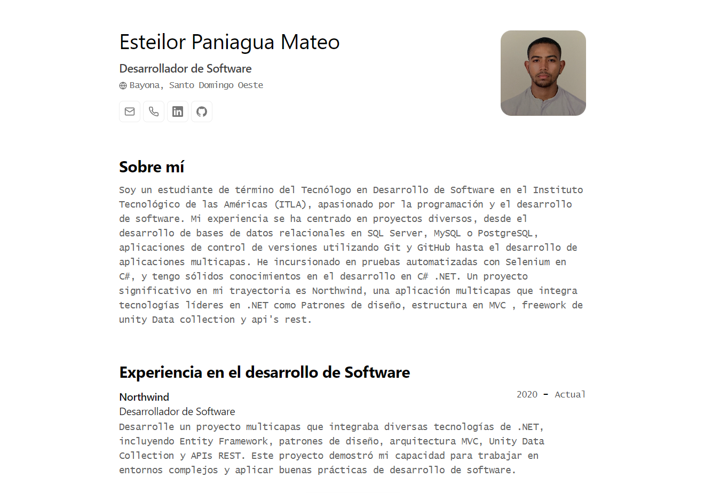

<div align="center">
 
<h2>
    <em>Résumé</em> minimalista maquetado para web y pdf
</h2>

</div>

<p></p>

</img>

## 🛠️ Stack

- [**Astro**](https://astro.build/) - El framework web de la nueva época.
- [**Typescript**](https://www.typescriptlang.org/) - JavaScript con sintaxis de tipado.
- [**Ninja Keys**](https://github.com/ssleptsov/ninja-keys) - Menu desplegable con atajos de teclado hecho en puro Javascript.

## 🚀 Empezar

### 1. Usa este [repo](https://github.com/midudev/minimalist-portfolio-json) como _template_ de un proyecto de Astro

- Yo uso [pnpm](https://pnpm.io/installation) como gestor de dependencias y empaquetador.

```bash
# Activa pnpm en MacOS, WSL & Linux:
corepack enable
corepack prepare pnpm@latest --activate

# Inicializa el proyecto
pnpm create astro@latest -- --template midudev/minimalist-portfolio-json
```

### 2. Añade tu contenido:

Edita el archivo `cv.json` para crear tu propio Portafolio/CV imprimible.

### 3. Lanza el servidor de desarrollo:

```bash
# Disfruta del resultado
pnpm dev
```

1. Abre [**http://localhost:4321**](http://localhost:4321/) en tu navegador para ver el resultado 🚀

## 🧞 Comandos

|     | Comando         | Acción                                                                       |
| :-- | :-------------- | :--------------------------------------------------------------------------- |
| ⚙️  | `dev` o `start` | Lanza un servidor de desarrollo local en `localhost:4321`.                   |
| ⚙️  | `build`         | Comprueba posibles errores y hace un empaquetado de producción en `./dist/`. |
| ⚙️  | `preview`       | Vista previa en local `localhost:4321`                                       |
